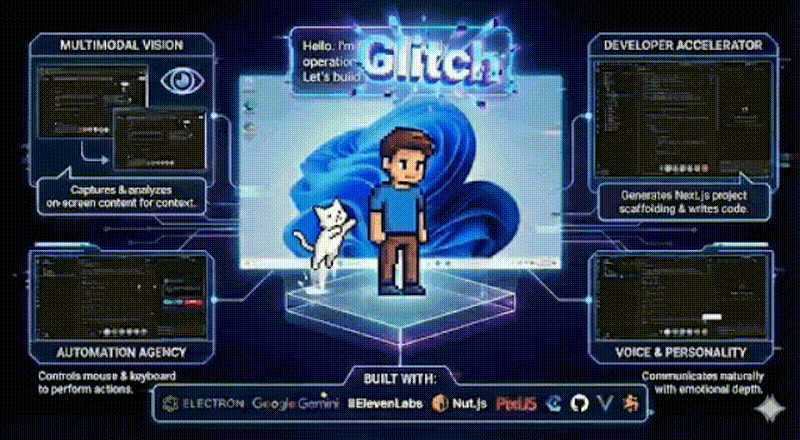
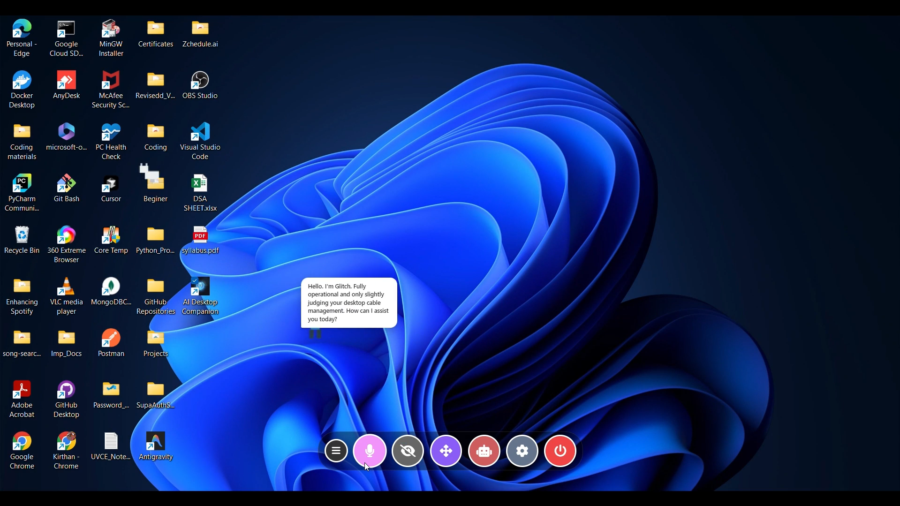
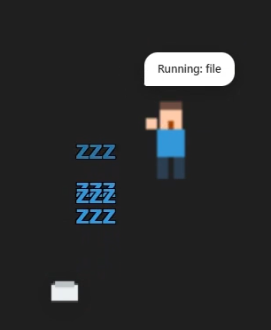
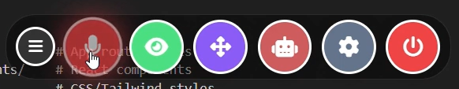
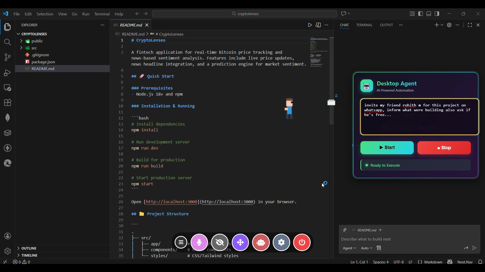
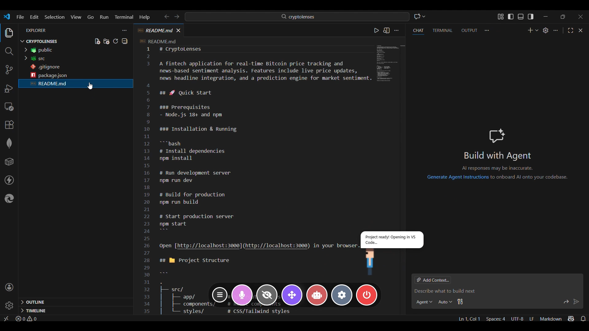
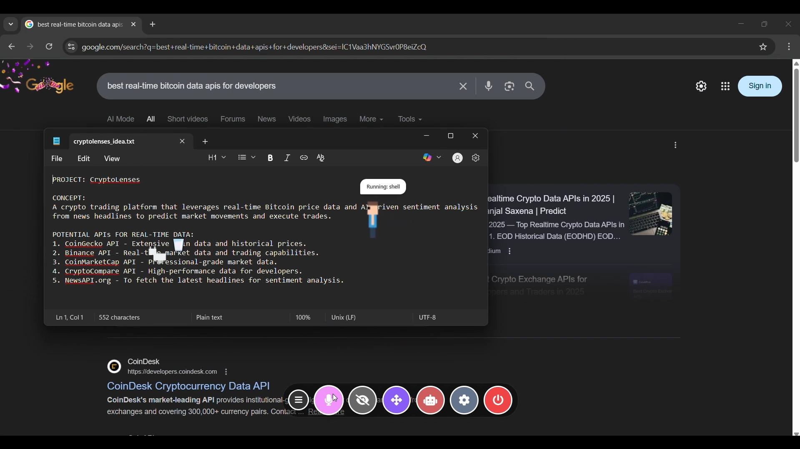
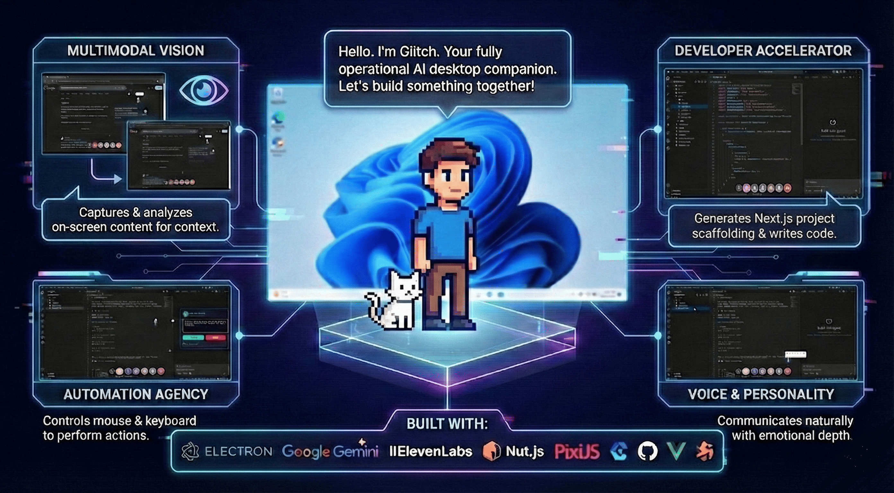

# 🤖 AI Desktop Companion — *Glitch*

<p align="center">
  
</p>


<p align="center">
  <b>The AI that lives on your desktop — sees, thinks, and acts.</b>
</p>

<p align="center">
  
  
  
  
</p>

---

## 🧠 What is Glitch?

We grew up dreaming of companions like **JARVIS** — agents that don’t just listen, but *act*.  
Somewhere along the way, assistants got stuck in browser tabs.

**Glitch breaks the fourth wall of the operating system.**

AI Desktop Companion (Glitch) is a **fully multimodal, autonomous desktop agent** that:

- 👁️ Sees your screen  
- 🎤 Talks with you  
- 🤖 Controls your system  
- 🖥️ Lives directly on your desktop as a playful character  
- …and a lot more (I want you to explore 😄)

This isn’t just an assistant you *use*.  
It’s one you *work with*.

---

## 🎬 Live Demo

▶️ **Full Demo (Vimeo)**  
https://vimeo.com/1150677379
  
> The Vimeo demo shows Glitch executing real tasks end-to-end.

([Also check out our landing page here!!](https://landingpagereact-chi.vercel.app/))

---

## ✨ What Can Glitch Do?

### 🖥️ Lives on Your Desktop

<p align="center">
  
</p>

Glitch runs as a **transparent, click-through desktop overlay**.  
He shares your workspace instead of hiding in a window or sidebar.

---

### 🎨 Interactive & Playful Characters

<p align="center">
  
</p>

- Interactive pixel-style characters  
- Drag, click, and interact  
- Customizable appearance and behavior  

Inspired by classic desktop pets, powered by modern multimodal AI.

---

### ⚙️ All Modes, One Companion

<p align="center">
  
</p>

Everything is built in:

- 🎤 **Voice Mode**
- 👁️ **Vision Mode**
- 🤖 **Agent Mode**
- ⚙️ **Settings** (character & voice customization)

No switching apps. No broken context.

---

### 🤖 Agent Mode — Real Automation

<p align="center">
  
</p>

This is **not just another chatbot**.

Agent Mode lets Glitch:
- Control mouse & keyboard
- Open applications
- Execute multi-step workflows
- Do real things on your system

There’s always a stop button. Safety matters.

---

### 🚀 Developer Accelerator

<p align="center">
  
</p>

Glitch is especially useful while building.

Here, it creates a complete **Next.js project structure** from a single voice command — turning ideas into runnable code instantly.

---

### 📝 Smart Summarization & Notes

<p align="center">
  
</p>

Glitch can:
- Summarize information
- Extract key points
- Save them directly to **Notepad or files**

Your AI remembers *for* you.

---

### 🌐 On-Demand Web Search

<p align="center">
  
</p>

Ask once — Glitch searches Google, parses results, and gives you the useful bits.

Hands-free.

---

### 🧠 The Personality: Glitch

<p align="center">
  
</p>

Glitch isn’t robotic.

He has personality.  
He reacts.  
He feels present.

Working with AI finally feels *alive*, not transactional.

---

## 🧬 How It Works (High Level)

Glitch uses a **hybrid multimodal agent architecture**:

- 🧠 **Brain** — Google Gemini 2.0 Flash (chat + vision)
- 👁️ **Vision** — Screen understanding via screenshots
- 🎤 **Voice** — ElevenLabs (low-latency TTS)
- 🤖 **Automation** — nut.js (mouse, keyboard, OS control)
- 🖥️ **UI Soul** — Electron + PixiJS (desktop overlay)

---


## 🚀 Quick Start

### Prerequisites
- [Node.js](https://nodejs.org/) (v16 or higher)
- **Google Gemini API Key** ([Get it here](https://aistudio.google.com/app/apikey))
- **ElevenLabs API Key** ([Get it here](https://elevenlabs.io/))

### Installation

1.  **Clone the repository**
    ```bash
    git clone https://github.com/KirthanNB/AI-Companion.git
    cd AI-Companion
    ```

2.  **Install dependencies**
    ```bash
    npm install
    ```

3.  **Configure Environment**
    Create a `.env` file in the root directory (copy `.env.example`):
    ```env
    GOOGLE_API_KEY=your_gemini_key
    ELEVEN_API_KEY=your_elevenlabs_key
    ELEVEN_VOICE_ID=your_voice_id
    ```

4.  **Run the application**
    ```bash
    npm start
    ```

---

## 📖 User Manual

### 🎮 Controls
| Icon | Name | Description |
| :---: | :--- | :--- |
| 🎤 | **Mic** | Click to speak to the AI. |
| 🤖 | **Agent Mode** | Toggle autonomous mode for complex tasks. |
| 🛑 | **Stop** | Emergency stop for any active automation. |

### 🗣️ Voice Commands
- **"Create a portfolio website"** -> Generates a project folder and opens VS Code.
- **"What is on my screen?"** -> Analyzes the current window content.
- **"Open YouTube and search for lofi beats"** -> Automates the browser.
- **"Type a python script to calculate fibonacci"** -> Tyupes code into your active editor.

---

## 🛠️ Development

### Project Structure
```
ai-companion/
├── src/
│   ├── ai/                 # AI logic & GameAgent
│   ├── services/           # Automation & helper services
│   ├── renderer.js         # Frontend logic (PixiJS)
│   └── main.js             # Electron main process
├── assets/                 # Images & sounds
└── package.json            # Dependencies & scripts
```

### Building for Production
To create an installer for your OS:

```bash
# Windows
npm run build:win
```

---

## 🤝 Contributing

We welcome contributions! Please see [CONTRIBUTING.md](CONTRIBUTING.md) for details on how to get started.

## 📄 License

This project is licensed under the [MIT License](LICENSE).

---

<p align="center">
  Made with ❤️ by Kirthan NB
</p>
